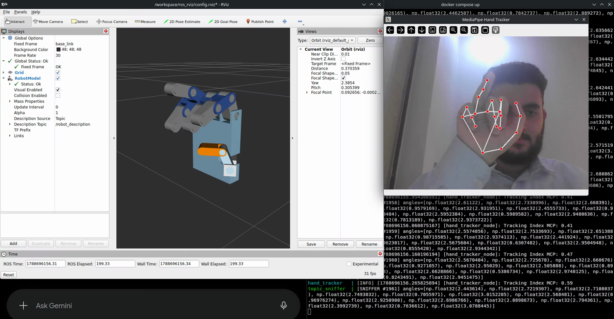
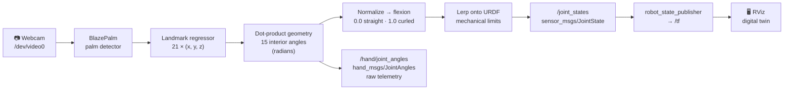
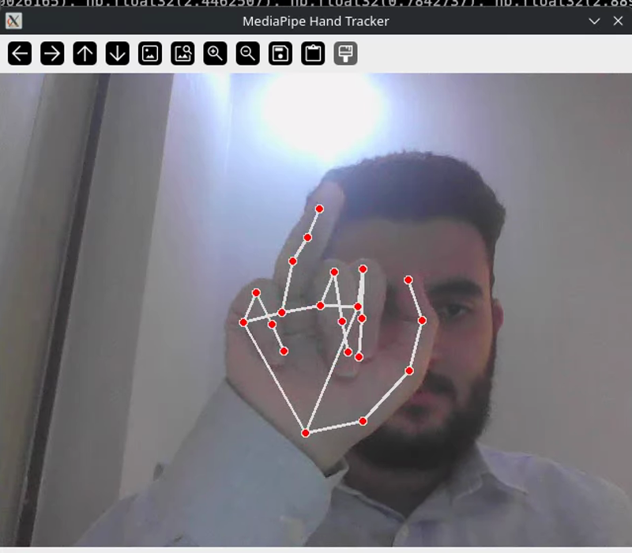
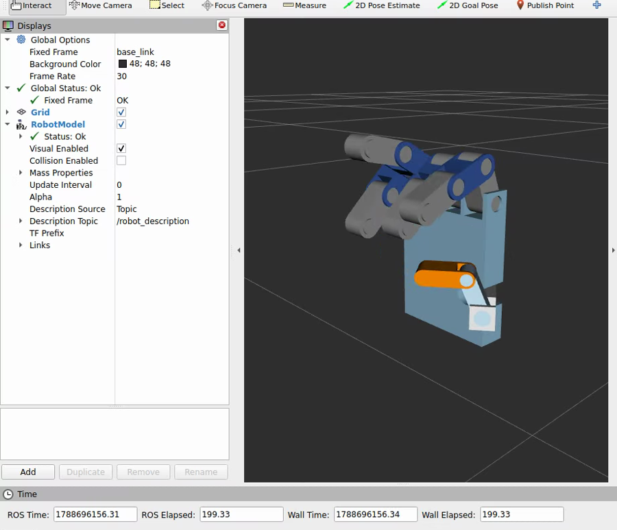

# ROS 2 MediaPipe Robotic Hand — Real-Time Teleoperation Digital Twin

[](https://docs.ros.org/en/jazzy/)
[](https://www.docker.com/)
[](https://ai.google.dev/edge/mediapipe)
[](https://www.gnu.org/licenses/agpl-3.0)
[](https://doi.org/10.5281/zenodo.22658556)

A 15-DOF robotic hand, driven live by a $20 webcam. No gloves, no markers, no depth sensor — a
standard RGB camera, two neural networks, some vector geometry, and a CAD model that mirrors your
hand in ROS 2 at 10 Hz.



[▶ Watch the screencast](https://github.com/user-attachments/assets/a009bd19-8073-4052-9b25-89f1b11a3a1d)

## What it does

Your hand moves. MediaPipe finds 21 landmarks in the camera frame. Fifteen of those landmark
triplets become interior joint angles by dot product. Each angle is normalized to a 0–1 flexion
ratio, then linearly interpolated onto the true mechanical limits of the corresponding joint in a
CAD-exported URDF. The result is published as a `sensor_msgs/JointState` and drives the digital
twin in RViz.



The mathematics is deliberately explicit rather than learned. Every joint angle is traceable from
three camera coordinates to a radian value in the URDF, which means every wrong movement has a
findable cause.

## Architecture

Four containers on ROS 2 Jazzy, sharing `ROS_DOMAIN_ID=42` over host networking:

| Service | Role | Key detail |
|---|---|---|
| `hand_tracker` | Vision + kinematics + publishing | The whole pipeline in one node, 10 Hz |
| `ros_rviz` | `robot_state_publisher` + `rviz2` | Deliberately runs **no** `joint_state_publisher` — the tracker is the state publisher |
| `topic_sniffer` | Subscribes to raw angles, prints them | Debug channel: isolates vision faults from mapping faults |
| `gazebo_sim` | Spawns the URDF into Gazebo Harmonic | Geometry only — [see limitations](#known-limitations) |

<table>
<tr>
<td width="50%"><br><em>21 landmarks, inferred from RGB alone</em></td>
<td width="50%"><br><em>The same pose on the CAD twin</em></td>
</tr>
</table>

## Quick start

**Prerequisites:** Linux host with X11, Docker Engine + Compose V2, a webcam at `/dev/video0`, and
ideally an Intel/AMD GPU at `/dev/dri` for hardware-accelerated rendering.

```bash
git clone https://github.com/mulhamfetna/ros2-mediapipe-robotic-hand-digital-twin-vision-teleoperation.git
cd ros2-mediapipe-robotic-hand-digital-twin-vision-teleoperation

# Authorize local containers to draw on your X server, create the Qt runtime dir, check for DRI
chmod +x setup_host.sh && ./setup_host.sh

# The usual pair: the twin plus the tracker
docker compose up --build ros_rviz hand_tracker
```

Two windows open: RViz with the hand model, and a MediaPipe preview with the landmark overlay. Put
your hand in frame and the model follows.

> [!IMPORTANT]
> `docker-compose.yml` bind-mounts an **absolute host path** (`/mnt/data/projects/ros-robotic-hand`)
> to `/workspace`, and the URDF references its meshes as `file:///workspace/assets/*.stl`. If you
> cloned this repository anywhere else, edit that path in the `ros_rviz` and `gazebo_sim` volume
> entries or RViz will start with no meshes. This is [known defect
> 4](docs/5-onshape-urdf/3-known-export-defects.md).

Add the other services as needed:

```bash
docker compose up topic_sniffer   # stream the raw angles
docker compose up gazebo_sim      # spawn into Gazebo Harmonic
```

Source directories are bind-mounted and both Python containers run `colcon build` on entry, so
editing `hand_tracker/src/hand_tracker_node.py`, the URDF or the RViz config needs only
`docker compose restart <service>` — no image rebuild unless a Dockerfile or dependency changes.

## The kinematic mapping

The core translation, from `hand_tracker/src/hand_tracker_node.py`:

```python
# Normalize flexion: 0.0 = completely straight, 1.0 = completely curled
flexion = (RAW_STRAIGHT_ANGLE - raw_angle) / (RAW_STRAIGHT_ANGLE - RAW_CURLED_ANGLE)
flexion = float(np.clip(flexion, 0.0, 1.0))

# Interpolate between the URDF's true Open and Closed limits
urdf_angle = open_angle + flexion * (closed_angle - open_angle)
```

`RAW_STRAIGHT_ANGLE = 3.10` rad (≈177°, an open hand) and `RAW_CURLED_ANGLE = 1.60` rad (≈90°, a
bent finger) are empirical calibration bounds, not derived constants — they define the window of
human motion that gets stretched across the mechanism's full range.

The 15 rows of `JOINT_MAPPING` bind each computed angle to a named URDF joint and its open/closed
radian limits. Sign conventions differ per joint because the CAD mates were built in different
orientations; the table encodes that rather than fighting it.

| Digit | Joints | Note |
|---|---|---|
| Thumb | `thumb_mcp` `thumb_pip` `thumb_dip` | Names follow the mechanism, not strict anatomy ([why](docs/3-kinematics/4-joint-nomenclature.md)) |
| Index | `index_mcp` `index_pip` `index_dip` | |
| Middle | `middle_mcp` `middle_pip` `middle_dip` | |
| Ring | `ring_mcp` `ring_pip` `ring_dip` | `ring_mcp` limits are currently **out of sync** with the URDF |
| Pinky | `twinky_mcp` `twinky_pip` `twinky_dip` | `twinky` is a legacy CAD name that propagated everywhere |

## Documentation

Full engineering notes live in [`docs/`](docs/README.md) — roughly 12,000 words written against
this code, not against a generic tutorial.

- **[Vision](docs/1-mediapipe/)** — the two-stage MediaPipe cascade, network architectures and
  losses, landmark-to-angle geometry, the 1€ filter, and four runnable demos
- **[Middleware](docs/2-ros2/)** — why ROS 2 earns its complexity, RViz vs Gazebo, building a
  package from scratch, and [this project's actual node graph](docs/2-ros2/4-this-projects-node-graph.md)
- **[Kinematics](docs/3-kinematics/)** — vector math, URDF anatomy, the mapping table, joint
  nomenclature in English and Arabic
- **[Infrastructure](docs/4-docker-compose/)** — every non-obvious flag in the compose file, a
  command reference, and the Gazebo path
- **[CAD → URDF](docs/5-onshape-urdf/)** — Onshape rules for a clean export, exporter setup, and an
  honest list of [what this export got wrong](docs/5-onshape-urdf/3-known-export-defects.md)

## Known limitations

Stated plainly, because they bound what this project demonstrates:

- **No hardware control.** The URDF describes geometry, not actuation — no transmissions, no
  controllers, no servos.
- **No physics.** `gazebo_sim` spawns the model into an empty world, but nothing drives it there.
  The working twin is the RViz one, and RViz is a visualizer, not a simulator.
- **No smoothing.** Raw landmark jitter passes straight through to the joint angles. The 1€ filter
  is [documented](docs/1-mediapipe/4-one-euro-filter.md) and implemented in the demos, but not yet
  wired into the ROS node.
- **Forward kinematics only, per joint.** Each joint is interpolated independently. No IK, no
  inter-joint coupling.
- **One `ring_mcp` mapping row is wrong** — it commands ~23° past the joint's mechanical stop.
  Documented in full in [known export defects](docs/5-onshape-urdf/3-known-export-defects.md).
- **Not relocatable** without editing the absolute paths described above.

## CAD

Designed in Onshape and exported with
[`onshape-to-robot`](https://github.com/rhoban/onshape-to-robot). The exporter reads mate names,
limits and material densities directly, so joint names and inertia tensors come from the CAD rather
than being hand-written — see [exporter setup](docs/5-onshape-urdf/2-exporter-setup.md).

Re-exporting needs Onshape API keys in a local `.env` (`ONSHAPE_API`, `ONSHAPE_ACCESS_KEY`,
`ONSHAPE_SECRET_KEY`) alongside the document IDs already in `config.json`. The `.env` is gitignored
and must stay that way.

## Citation

If you use this software, its architecture, or the kinematic mapping methodology in your research,
please cite it. Metadata lives in [`CITATION.cff`](CITATION.cff); GitHub renders a ready-made
citation from the *Cite this repository* button in the sidebar.

The **concept DOI [10.5281/zenodo.22658556](https://doi.org/10.5281/zenodo.22658556)** always resolves to the
latest version; cite it unless you need to pin a specific release. v1.0.0 is
[10.5281/zenodo.22658557](https://doi.org/10.5281/zenodo.22658557).

```bibtex
@software{fetna_ros2_mediapipe_robotic_hand_2026,
  author    = {Fetna, Mulham Mohammed},
  title     = {{ROS 2 MediaPipe Robotic Hand: Real-Time Teleoperation Digital Twin}},
  year      = {2026},
  version   = {1.0.0},
  publisher = {Zenodo},
  doi       = {10.5281/zenodo.22658556},
  url       = {https://doi.org/10.5281/zenodo.22658556}
}
```

## License

[GNU Affero General Public License v3.0](LICENSE). Derivative works — including anything offered
over a network — must remain open source under the same terms.

## Author

**Mulham Mohammed Fetna** — robotics and mechatronics engineer.
[ORCID](https://orcid.org/0009-0006-4432-798X) ·
[Google Scholar](https://scholar.google.com/citations?user=h1Yvl2QAAAAJ&hl=en) ·
[GitHub](https://github.com/mulhamfetna) · [contact@mulhamfetna.com](mailto:contact@mulhamfetna.com)
