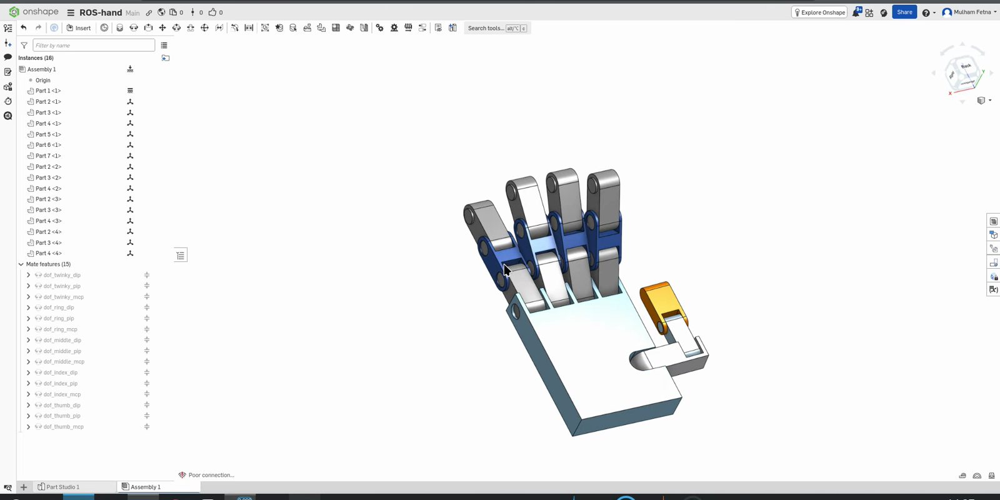

# URDF Anatomy

The URDF is where a CAD assembly becomes something ROS 2 can reason about — a tree of rigid bodies
connected by constrained joints. This document walks
[`ros_rviz/urdf/robot.urdf`](../../ros_rviz/urdf/robot.urdf) as it was actually exported.

The URDF file acts as the mechanical blueprint of your robot, translating CAD components exported from Onshape into a mathematical tree structure that ROS 2, RViz, and Gazebo can interpret.

**The Root and Palm Foundation**

* **`<robot name="ros-robotic-hand">`**: The global container defining the entire assembly.
* **`base_link`**: A virtual origin point with near-zero mass used to anchor the robot in world space. It connects via a `fixed` joint to **`part_1`**, which serves as the physical palm of the hand.

**Anatomy of a Link Block**
Every physical bone or structural segment in the hand is defined as a `<link>` containing three essential sub-elements:

* **`<inertial>`**: Defines the physical weight (`mass`), center of mass (`origin`), and rotational resistance matrix (`ixx`, `iyy`, `izz`). While RViz ignores this, Gazebo's physics engine requires these values to calculate gravity and inertia.
* **`<visual>`**: Tells the renderer which 3D model file (`.stl`) to draw on screen, along with its color material and spatial offset.
* **`<collision>`**: Defines the simplified boundary geometry used by physics engines to calculate when the hand bumps into objects. In this auto-generated file, it points directly to the same STL files as the visual tag.

**Anatomy of a Joint Block**
Joints connect child links to parent links, establishing how parts move relative to one another:

* **`type="revolute"`**: Specifies a hinged joint that rotates around a specific axis within strict radian limits (`<limit lower="..." upper="..." />`).
* **`<origin>`**: The 3D translation (`xyz`) and rotation (`rpy`) offset specifying where the joint is located on the parent link.
* **`<axis>`**: Defines which local vector axis (`0 0 1`, meaning the Z-axis) the joint rotates around.

*Where the tree comes from: each `dof_`-prefixed mate in the Onshape assembly becomes one
`<joint>` in the URDF, and each part instance becomes one `<link>`.*

**The 15-DOF Finger Architecture**
The file maps 5 digits, each containing 3 revolute joints (MCP at the base, PIP in the middle, and DIP at the tip), totaling 15 degrees of freedom:

* **Pinky Finger**: Labeled in the CAD tree using the legacy name `twinky` (`twinky_mcp`, `twinky_pip`, `twinky_dip` connecting links `part_1` through `part_4`).
* **Ring Finger**: Uses suffix `_2` (`ring_mcp`, `ring_pip`, `ring_dip` connecting `part_1` to `part_2_2`, `part_3_2`, `part_4_2`).
* **Middle Finger**: Uses suffix `_3` (`middle_mcp`, `middle_pip`, `middle_dip` connecting `part_1` to `part_2_3`, `part_3_3`, `part_4_3`).
* **Index Finger**: Uses suffix `_4` (`index_mcp`, `index_pip`, `index_dip` connecting `part_1` to `part_2_4`, `part_3_4`, `part_4_4`).
* **Thumb**: Uses standalone parts `part_5`, `part_6`, and `part_7` driven by `thumb_mcp`, `thumb_pip`, and `thumb_dip`.