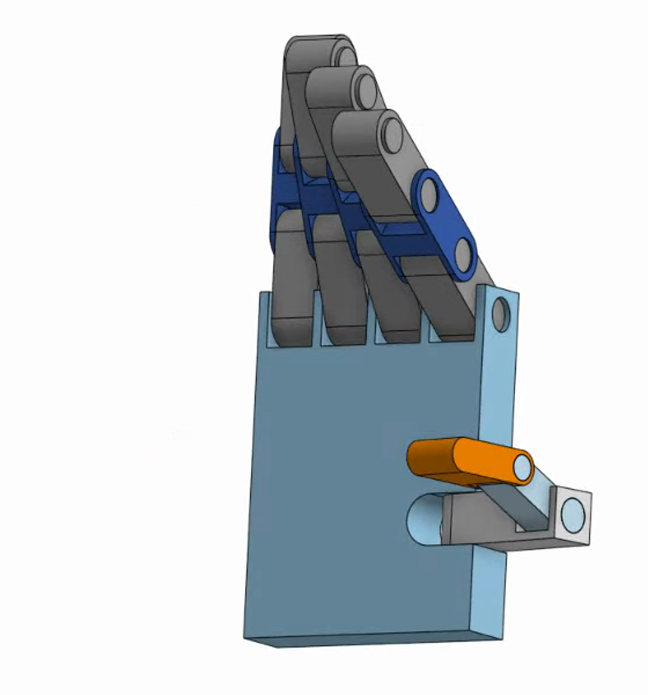

# Joint Nomenclature

Every joint name in the URDF and in `JOINT_MAPPING` is an anatomical abbreviation. This is the
reference for what they mean, where they sit on the mechanism, and the Arabic terms for each —
useful when presenting or documenting the work bilingually.

## Finger joints — index, middle, ring, pinky

Each of the four fingers carries three revolute joints, numbered outward from the palm.

| Abbrev. | Full name | Position | Arabic |
|---|---|---|---|
| **MCP** | Metacarpophalangeal | Base knuckle, where the finger meets the palm | المفصل السنعي السلامي |
| **PIP** | Proximal interphalangeal | Middle joint of the finger | المفصل بين السلاميات الداني |
| **DIP** | Distal interphalangeal | Outermost joint, nearest the fingertip | المفصل بين السلاميات القاصي |

*Proximal* means nearer the body; *distal* means further from it. So the PIP is the interphalangeal
joint closer to the palm, and the DIP is the one closer to the tip.

## Thumb joints

The thumb is anatomically different — it has one fewer phalanx and its base joint is a saddle joint
at the wrist rather than a knuckle at the palm.

| Abbrev. | Full name | Position | Arabic |
|---|---|---|---|
| **CMC** | Carpometacarpal | Base joint connecting the thumb assembly to the palm | المفصل الرسغي السنعي |
| **IP** | Interphalangeal | The thumb's single middle joint | المفصل بين السلاميات |

## What this project actually names them

The mechanism is a simplification of the anatomy, and the naming follows the mechanism rather than
the textbook. **All five digits use the `mcp` / `pip` / `dip` suffixes**, including the thumb:

```python
('thumb_mcp',   0, -1.377,  0.194),
('thumb_pip',   1, -1.126,  0.445),
('thumb_dip',   2, -1.142,  0.429),
```

So `thumb_mcp` occupies the position an anatomist would call the CMC, and `thumb_pip` roughly
corresponds to the MCP. The naming is internally consistent — five digits × three joints = the
15 DOF — which is what matters for the code, but it is worth knowing the mapping is approximate
if you are comparing against biomechanics literature.

The pinky is named `twinky` throughout, for
[reasons that are not anatomical](../5-onshape-urdf/3-known-export-defects.md).

## Which MediaPipe landmarks correspond

The [triplet table](../1-mediapipe/3-landmarks-to-angles.md) picks three landmarks per joint — the
joint itself as the vertex, plus its two neighbours. For the index finger:

| Joint | Triplet | Vertex landmark |
|---|---|---|
| `index_mcp` | (0, 5, 6) | 5 — index MCP |
| `index_pip` | (5, 6, 7) | 6 — index PIP |
| `index_dip` | (6, 7, 8) | 7 — index DIP |

Note the MCP triplet's first point is landmark **0, the wrist** — the palm has no landmark at the
base of each metacarpal, so wrist→MCP stands in for the metacarpal bone. This is why MCP angles are
the least anatomically faithful of the three, and why their URDF limits are the narrowest.

## Locating the joints on the mechanism


*Fingers extended. The blue linkages carry the finger joints; the orange link drives the thumb.*



*Curled. This is the more useful view for a labelled figure — the hierarchy at each knuckle is
visible rather than collapsed into a straight line.*

For a publication figure, draw leader lines from the mechanical pins to the labels above:

- **DIP** → the highest pin, connecting the blue linkage to the grey fingertip.
- **PIP** → the middle pin, halfway down the blue linkage.
- **MCP** → the lowest pin, connecting the linkage to the palm block.
- **IP** → the pin connecting the orange link to the grey thumb piece.
- **CMC** → the base pin joining the orange link to the grey mounting bracket.

Stack the finger labels in a left-aligned column on the left of the image and the thumb labels on
the right, with simple arrowhead terminals in solid black or white depending on the background.
