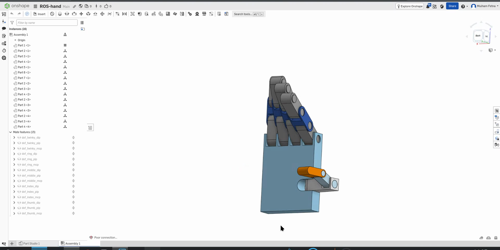

# CAD Rules for a Clean Export

Five habits that move work from Python back into Onshape, where it belongs. Each rule below exists
because its absence cost real time on this project — see
[known export defects](3-known-export-defects.md) for the specific damage.

The assembly is public if you want to inspect it directly:
**[ROS-hand on Onshape](https://cad.onshape.com/documents/a2dbb5f16624f10f1aa22f02/w/3eff80c19eddad52bfa92f87/e/4d69727744037003575f4068)**

*The `Mate features (15)` tree is the contract. Every name in it becomes a URDF joint name, and
every URDF joint name has to match a string in the Python mapping table.*

Bridging the gap between a modern, modular CAD platform like Onshape and the rigid, 15-year-old XML standards of ROS/URDF is where most roboticists lose days of their lives.

Because the `onshape-to-robot` exporter blindly translates exactly what it sees in your CAD assembly, any shortcuts taken in CAD become catastrophic bugs in ROS. Based on the URDF errors we had to manually bypass (like the `twinky` vs `pinky` naming, the duplicate `part_2_2` links, and the manual limit mapping in Python), here is the exact protocol to make the CAD-to-ROS pipeline a "one-shot" export in the future.

### 1. The Naming Dictatorship (Mates = Joints)

**The Trap:** In Onshape, it is easy to leave mates with default names like `Revolute 1` or use legacy names from old iterations (like `twinky` instead of `pinky`).

The exporter's convention is the `dof_` prefix: a mate named `dof_index_mcp` is exported as a
joint, and one without the prefix is not exported as a joint at all. The prefix is then **stripped**,
so the mate `dof_index_mcp` becomes `<joint name="index_mcp">`. That is why the mate tree in this
assembly reads `dof_twinky_dip`, `dof_ring_mcp`, `dof_thumb_pip` and so on, while the URDF reads
`twinky_dip`, `ring_mcp`, `thumb_pip`.

Two consequences follow. Forget the prefix and your joint silently becomes a rigid weld. And
whatever you write after the prefix is what the Python mapping table must match, character for
character.
**The One-Shot Fix:**

* Rename every single moving Mate in the Onshape Assembly tree to its final ROS topic name before exporting (e.g., `index_mcp`, `thumb_dip`).
* If you duplicate a finger assembly in Onshape, you must manually go into the new duplicated folder and rename its mates (`ring_mcp`, `ring_pip`). If you don't, the exporter crashes or merges them incorrectly — which is exactly why the first export of this hand was missing the ring finger's MCP joint.

### 2. Hardcoding Limits at the CAD Level

**The Trap:** We had to build that massive `JOINT_MAPPING` dictionary in your Python script because the exported URDF joints were free-spinning or had incorrect radian bounds.
**The One-Shot Fix:**

* Inside Onshape, double-click every Revolute Mate and check the **"Limits"** box.
* Type in the exact physical minimum and maximum degrees of freedom for that joint.
* The `onshape-to-robot` tool will automatically read these visual limits, convert them to radians, and bake them permanently into the `<limit lower="..." upper="...">` tags of your URDF, allowing you to delete the manual mapping step in Python entirely.

### 3. The Z-Axis Rule of Robotics

**The Trap:** If you mate parts haphazardly in CAD, your fingers might bend along the X-axis in Onshape, but when imported to RViz, the ROS coordinate math gets twisted, causing fingers to bend sideways or invert.
**The One-Shot Fix:**

* ROS assumes that all 1D revolute joints rotate around the **Z-axis**.
* When creating the Mate in Onshape, use the "Realign Secondary Axis" button to ensure the blue Z-axis arrow is pointing directly through the hinge pin for every single knuckle.

### 4. Mandatory Material Assignment (The Gazebo Tax)

**The Trap:** RViz only cares about the STL mesh (`<visual>`), but Gazebo refuses to load any part that lacks mass and inertia calculations (`<inertial>`).
**The One-Shot Fix:**

* In the Onshape Part Studio, you cannot leave parts as generic geometry. You must right-click every part (or bulk select) and choose **Assign Material** (e.g., ABS Plastic, Aluminum).
* The exporter uses this exact material density to automatically calculate the complex `ixx`, `iyy`, and `izz` inertia matrices for the URDF. If you forget the material, Gazebo assigns a mass of zero, and the physics engine instantly collapses the hand.

### 5. Grounding with `base_link`

**The Trap:** If you just export a hand, ROS doesn't know how it connects to the universe, causing TF (Transform) tree errors.
**The One-Shot Fix:**

* Create a tiny, invisible dummy part or coordinate frame in Onshape named `base_link`.
* Apply a **Fastened Mate** between `base_link` and your palm (`part_1`).
* This gives the URDF a defined root anchor, perfectly aligning with standard ROS coordinate systems.

If you lock in those five steps at the CAD level, running the `onshape-to-robot` script will output a flawless URDF that can be dropped directly into RViz and Gazebo with zero manual XML editing.